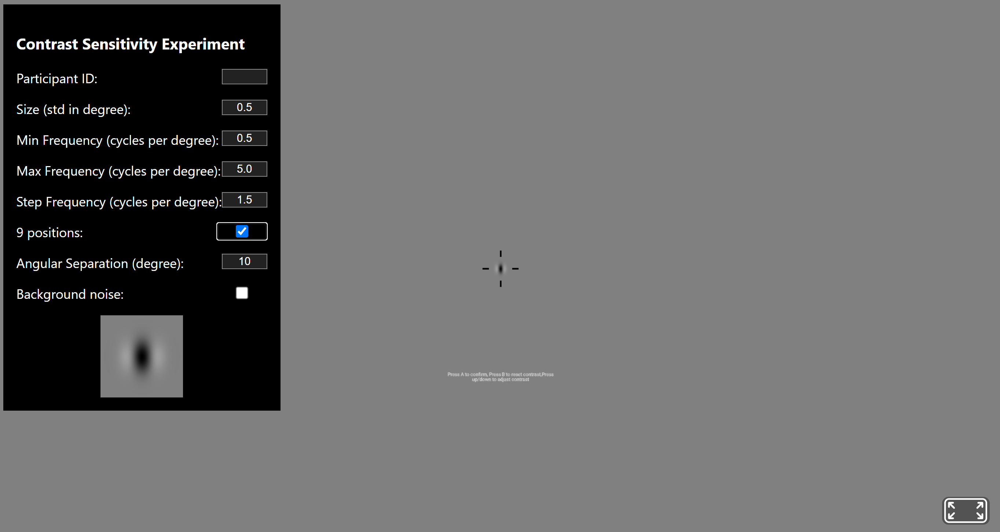

# Contrast Perception Evaluation on Medical Extended Reality Devices
We develop a method for the evaluation of contrast perception on medical extended reality (MXR) devices using virtual (VR) or augmented reality (AR) head-mounted displays (HMDs). Image quality evaluation on VR and AR HMDs is primarily based on optical bench measurement on a single eyepiece. However, this approach generally requires complicated bench setup that emulates the human eye geometry. In addition, binocular image quality discrepancy on HMDs may affect the perceptual performance that is missing from monocular bench measurement. This tool describes a method and software platform to characterizes the image quality on VR and AR HMDs using human perceptual experiments. Specifically, the contrast sensitivity (CS) of human participants is measured at multiple positions across the HMD field of view (FOV). 

This tool provides a software test platform using WebXR Device API to perform human perceptual experiments on VR or AR HMDs in an immersive environment, which can be loaded on an HMD web browser that supports WebXR. 

The WebXR-based platform to perform perceptual experiments is available here: [MXR Contrast Perception Tool](https://chuminzhao.github.io/ContrastPerceptionMXR/)

Documentation for this tool is available here: [Documentation](https://chuminzhao.github.io/ContrastPerceptionMXR/documentation/)

## User interface



## Download the repository using the following options (optional):
1. Click on the green code button and select Download zip. 
2. Download the repository as a zip file or use the command line, navigate to destination folder (cd command), and type ```git clone https://github.com/chuminzhao/ContrastPerceptionMXR.git```

Note: The lib folder is nessecary for Aframe dependencies.

## Comments and limitations
1. This tool requires to access a WebXR-compatible browser on the evaluated HMD. Compatibility of the HMD needs to be validated before the experiment. 
2. The rendered image resolution is dependent on the WebXR rendering engine. Spatial frequencies beyond 6 cycles per degree may be subject to aliasing effect and therefore performing contrast sensitivity experiments beyond spatial frequency of 6 cycles per degree is not recommended. 

