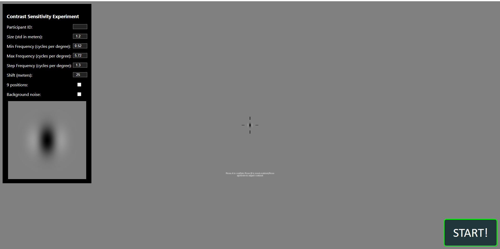

# MXR Contrast Perception Tool
We have developed a medical extended reality (MXR) contrast perception tool to evaluate the image quality of head-mounted displays (HMDs). In general, image quality on virtual and augmented reality (VR and AR) HMDs is subject to limited image resolution, contrast degradation, nonuniformity, among other image artifacts depending on the display and optics technologies. In addition, most HMDs present stereo image pairs and the image quality experienced by the user is dependent on the fusion of binocular images. Unfortunately, image quality on HMDs may vary spatially between two eyepieces and therefore requires binocular image quality evaluation methods. 

This MXR contrast perception tool can be used to evaluate binocular perceptual image quality in support of performance testing on MXR devices using VR or AR technologies. In addition to performing optical bench testing to evaluate the image quality, this regulatory science tool provides a simple workflow to quantify perceptual contrast and effective resolution of HMDs using human perceptual experiments. Specifically, the threshold (minimum) visible contrast of a human participant, is measured using a 2D sinusoidal pattern with predefined contrast and spatial frequency, known as a Gabor target, rendered at a single or multiple locations across the HMD field of view (FOV). The experimental results are summarized as the contrast sensitivity response (CSR) at each measured position that is a combination of HMD modulation transfer function (MTF) and human contrast sensitivity capability. 

In the experiment, the location, size, spatial frequency range, and background noise of the Gabor target can be adjusted during initial setup. The depth of the target is fixed at a long distance of 150 m. During the perceptual experiments, the target's contrast can be incremented or decremented by adjusting the display gray level using a headset controller or Bluetooth keyboard until reaching the threshold contrast of each trial. At the end of the experiment, all trial data is saved as a JSON file used to calculate the CSR. Statistical analysis of the results measured on mulitple human participants is recommended to minimize the experimental error from individual participants.

The tool features a user interface built with A-Frame, Three.js, and WebXR, facilitating the creation of image quality test patterns. It is accessible via any WebXR-compatible device with internet access, and the results are downloadable as a JSON file at the conclusion of the experiment, making it simple for users to test and save results.

The tool is available here: [MXR Contrast Perception Tool](https://khushibhansali.github.io/WebXR-contrast-sensitivity-tool/)

Documentation for the tool is available here: [Documentation](https://khushibhansali.github.io/WebXR-contrast-sensitivity-tool/documentation/)


## User interface



## Download the repositiory using the following options:
1. Click on the green code button between add file button and about section. 
2. Download the repositiory as a zip file or use the command line, navigate to destination folder (cd command), and type ```git clone https://github.com/Khushibhansali/WebXR-contrast-sensitivity-tool.git```

Note: The lib folder is nessecary for Aframe dependencies.

## Comments and limitations
1. This tool requires to access a WebXR-compatible browser on the evaluated HMD. Compatbility of the HMD needs to be validated before the experiment. 
2. The rendered image resolution is dependent on the WebXR rendering engine. Spatial frequencies beyound 6 cycles per degree may be subject to anti-aliasing effect and therefore performing contrast sensitivity experiments beyound spatial frequency of 6 cycles per degree is not recommended. 

