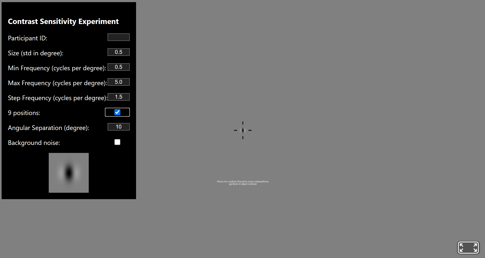

# COPE: Contrast Perception Evaluation on Head-Mounted Displays
We develop a method for the evaluation of contrast perception on medical extended reality (MXR) devices using virtual (VR) or augmented reality (AR) head-mounted displays (HMDs). Image quality evaluation on VR and AR HMDs is primarily based on optical bench measurement on a single eyepiece. However, this approach generally requires complicated bench setup that emulates the human eye geometry. In addition, binocular image quality discrepancy on HMDs may affect the perceptual performance that is missing from monocular bench measurement. This tool describes a method and software platform to characterizes the image quality on VR and AR HMDs using human perceptual experiments. Specifically, the contrast sensitivity response (CSR) of human participants is measured at multiple positions across the HMD field of view (FOV). 

This tool provides a software test platform using WebXR Device API to perform human perceptual experiments on VR or AR HMDs in an immersive environment, which can be loaded on an HMD web browser that supports WebXR. 

The WebXR-based platform to perform perceptual experiments is available here: [COPE](https://DIDSR.github.io/COPE/)

Documentation for this tool is available here: [Documentation](https://DIDSR.github.io/COPE/documentation/)

## User interface



## Download the repository using the following options (optional):
1. Click on the green code button and select Download zip. 
2. Download the repository as a zip file or use the command line, navigate to destination folder (cd command), and type ```git clone https://github.com/DIDSR/COPE.git```

Note: The lib folder is nessecary for Aframe dependencies.

## Comments and limitations
1. This tool requires to access a WebXR-compatible browser on the evaluated HMD. Compatibility of the HMD needs to be validated before the experiment. 
2. The rendered image resolution is dependent on the WebXR rendering engine. Spatial frequencies beyond 6 cycles per degree may be subject to aliasing effect and therefore performing contrast sensitivity experiments beyond spatial frequency of 6 cycles per degree is not recommended. 

## Tool Reference 
RST Reference Number: RST26MX01.01
Date of Publication: 05/04/2026
Recommended Citation: U.S. Food and Drug Administration. (2026). COPE: Contrast Perception Evaluation on Head-Mounted Displays (RST26MX01.01). https://cdrh-rst.fda.gov/cope-contrast-perception-evaluation-head-mounted-displays

## Disclaimer
About the Catalog of Regulatory Science Tools
The enclosed tool is part of the Catalog of Regulatory Science Tools, which provides a peer-reviewed resource for stakeholders to use where standards and qualified Medical Device Development Tools (MDDTs) do not yet exist. These tools do not replace FDA-recognized standards or MDDTs. This catalog collates a variety of regulatory science tools that the FDA's Center for Devices and Radiological Health's (CDRH) Office of Science and Engineering Labs (OSEL) developed. These tools use the most innovative science to support medical device development and patient access to safe and effective medical devices. If you are considering using a tool from this catalog in your marketing submissions, note that these tools have not been qualified as Medical Device Development Tools and the FDA has not evaluated the suitability of these tools within any specific context of use. You may request feedback or meetings for medical device submissions as part of the Q-Submission Program.
For more information about the Catalog of Regulatory Science Tools, email RST_CDRH@fda.hhs.gov.

